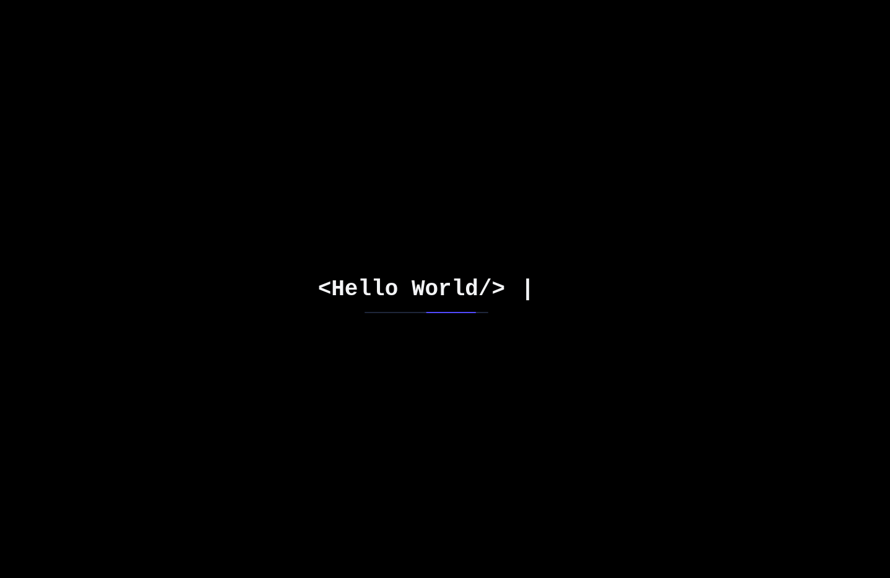
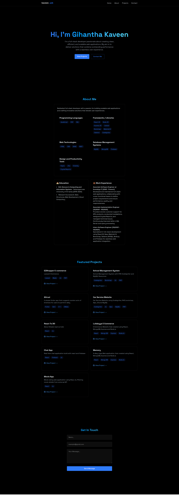

# Kaveen.web

Kaveen.web is a personal portfolio built using **React**, **Tailwind CSS**, **JavaScript**, and **HTML**. It is a single-page web application designed to showcase your projects and personal information.

---

## Features

- **Home**: Welcome message
- **About**: Information about me
- **Projects**: Showcase of my work
- **Contact**: Get in touch with me

---

## Installation

Follow these steps to set up the project locally:

1. **Clone the repository**:

   ```bash
   git clone "https://github.com/gihantha/portfolio"

   ```

2. Navigate to the project directory:

   ```bash
   cd portfolio
   ```

3. Install dependencies:

   ```bash
   npm install
   ```

4. Create a `.env` file and configure your environment variables (database credentials, Stripe keys, etc.).

5. Start the development server:

   ```bash
   npm run dev
   ```

6. Access the application in your browser at `http://localhost:5173/`.

## Screenshots

### General

**Login Page:**


**Full Page:**


## License

This project is licensed under the [MIT License](LICENSE).

## Contributions

Contributions are welcome! Feel free to submit a pull request or open an issue for suggestions and improvements.

## Contact

For further inquiries or support, please contact gihantha01@gmail.com.
